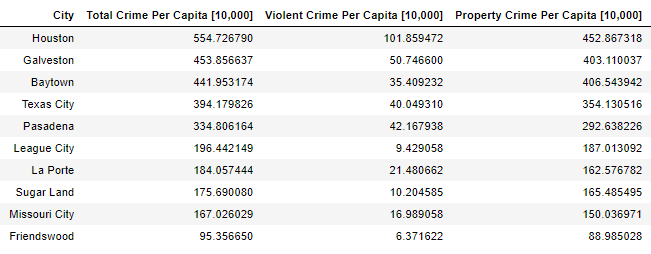
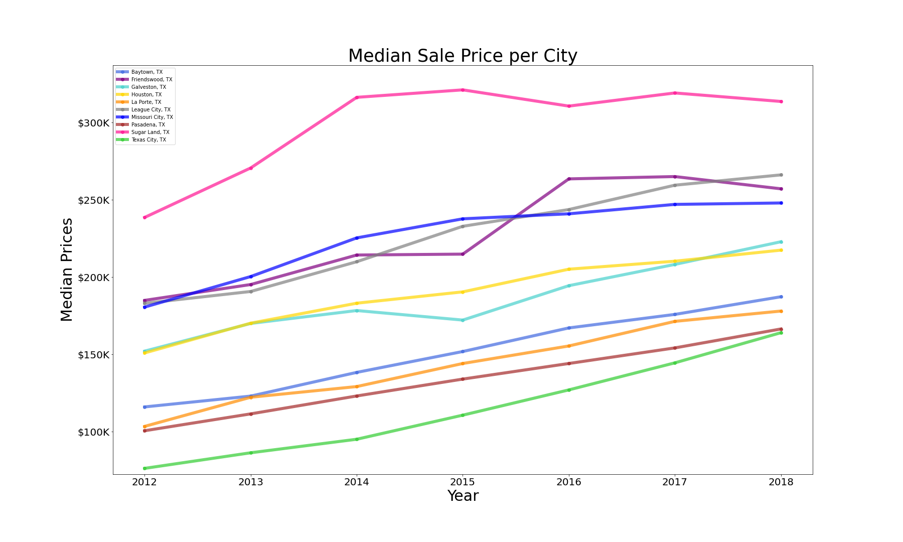
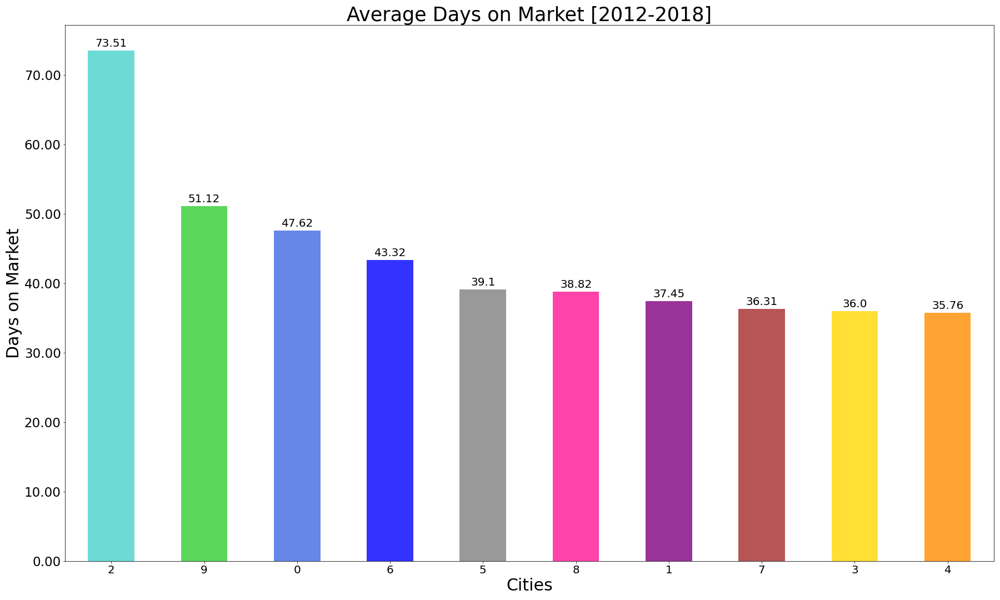

# Effect of Crime on the Housing Market in the Houston Metro-Area

## Introduction:
The largest and most important purchase that a consumer will make in his lifetime is a house. A lot of time and energy goes into determining exactly what one wants in a new home. The buyer must figure out their preferences regarding the location of the house, including the city,  neighborhood, and proximity to certain amenities and general aesthetic style while a significant amount of attention is drawn into crime, school and life quality. Theoretically, homebuyers would pay a premium in order to live in a physically safe environment to avoid crime, as well as the mental security of knowing that they are safe.  In this report we will take a closer look into the methodology and results of analyzing Houston and a selection of surrounding cities’ crime data and housing market. The analysis in this report focuses on the years between 2012-2018 and examines the following:

* What is the average crime rate across the top 10 largest cities in the Houston metropolitan area?
* What is the average and median sales price across the top 10 largest cities in the Houston metropolitan area?
* Do houses stay on the market longer in higher crime areas?
* Is there a correlation between average or median sales price and the average or median crime rate crime?
* Do violent crimes or non-violent crimes have a bigger impact on home sales?
* What is the effect of city demographics on median price and crime rates?

## Methodology
The study performed relied on two major data sets. The housing market data set from Redfins and a crime data set from the FBI’s Uniform Crime Reporting. It was noted that the available information for the housing data extended from 2012 to 2020. However, the crime data only had summarized results per city up to the year 2018. The decision was made to utilize only data that had overlapping years, therefore focusing on 2012-2018.
Our next step was to determine what cities the study would focus on. The study focused on a 50-mile radius from Houston and only looked at a randomly selected list of 10 cities with a population size greater than 10,000, this population cap would allow the data to be compared on a per capita basis. The cities that were looked at for the study are as follows: Baytown, Friendswood, Galveston, Houston, La Porte, League City, Missouri City, Pasadena, Sugar Land, and Texas City.

## Crime Analysis
In order to compare the number of crimes based from city to city, the values were changed to represent crime values per 10,000 people. We then focused on determining plotting the crime over the 2012-2018 time period to gain an understanding of how the crime rate looked like for the individual cities. The graph shown below illustrates that there is no visual significant change to indicate that crime rate is decreasing among the cities. The five least dangerous cities all stay around their respective crime rate per year. Whereas there is more slight volatility with the five most dangerous cities. 

The next step in the study was to determine the mean per city. This would allow us to visualize a comparison between each respective city for the 7-year period. The graph below shows the cities ranked from most to least dangerous based on crime rate per 10,000 people.

The graph also shows a breakdown between the types of crimes each city has, whether it is violent crimes or property crime. These two values along with the total were accounted for to utilize when comparing housing market data against total crime, violent crime, and property crime. The goal is to determine if there is any correlation among housing market parameters and the three crime parameters. The table shows the values utilized to create the bar graph.

## Results
### What is the average crime rate across the top 10 largest cities in the Houston metropolitan area?

The initial analysis examined the crime per capita for each city from 2012 to 2018.  The data indicates that most cities in scope have lower crime rates in 2018 as compared to 2012.  The city with the highest crime rate over the last seven years is Houston followed by Galveston and Baytown.  The safest city over the last seven years is Friendswood, followed by Missouri City and Sugar Land.

Calculating the mean crime rate per capita over the last seven years, Houston has the highest amount of crime in the metropolitan area and nearly six times as much crime as the city with the lowest amount of crime, Friendswood.  Houston also has the highest amount of violent and property crimes in the metropolitan area.  Galveston and Baytown are ranked second and third respectively for the highest amount of crime in the metropolitan area.  For each city in scope, the property crimes far outweigh the number of violent crimes.  The safest city in the metropolitan area is Friendswood followed by Missouri City and Sugar Land.

### What is the average and median sales price across the top 10 largest cities in the Houston metropolitan area?

Now as we look around Houston and it’s surrounding cities/suburbs, we want to get an idea of what the housing market looks like throughout the area. The primary trend for the observed period is up in the period from 2012 to 2018, which is inline with housing prices nationwide in that timeframe. 

Looking more specifically into the sample of cities discussed. The median prices go from $73,000 to just over $300,000. Sugar Land is the most expensive city during the whole study period and Texas City has the cheapest housing prices in the market, the difference between these two cities got to be upwards of $200,000 and the distance between these two cities is of about 50 miles. If one could split the sample cities into group one could argue that there are three groups with similar trends. The more expensive group would contain Sugar Land, Missouri City, League City, and Friendswood, the second group would have Houston itself and Galveston, and the lowest-priced group would include Baytown, La Porte, Pasadena and Texas City

### Do houses stay on the market longer in higher crime areas?

Another useful set of datapoints when analyzing the housing trends in the Houston area and it’s surrounding is the average days on market:

It was observed that in the city of Galveston, by far houses have stayed in the market for longer than in the rest of the studied areas with Texas City and Baytown coming in next, which now shows how these two cities are both in the lower average housing prices range as well as with the most days on market on average before finalizing a sale 

### Is there a correlation between average or median sales price and the average or median crime rate crime?
Placeholder text 

### Do violent crimes or non-violent crimes have a bigger impact on home sales?
Placeholder text

### What is the effect of city demographics on median price and crime rates?
Placeholder text

### References
1. Crime Data: https://www.fbi.gov/services/cjis/ucr/publications
2. Housing Market Data: https://www.redfin.com/blog/data-center/
